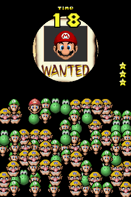

# Mario MiniGame Competition

<p align="center">
  
</p>

Le but de ce workshop est de créer un programme capable de jouer à un des mini-jeux de New Super Mario Bros, Wanted!

Ici vous retrouverez les instructions pour une reconnaissance d'image basique, et ce sera ensuite à vous d'imaginer la suite pour obtenir un programme encore plus rapide et performant. Le but est d'obtenir le score le plus haut possible et se créer une place dans le classement!

## Requirements

Pour ce workshop, nous allons utiliser plusieurs librairies python: pillow pour la manipulation de l'image, et pyautogui pour contrôler la souris, faire des captures d'écran et faire de la reconnaissance d'image avec la librairie cv2.

- python 3
  ```
  sudo apt update
  sudo apt install python3
  ```
- cv2
    ```
    pip3 install opencv-python
    ```
- pillow
  ```
  pip3 install pillow
  ```
- pyautogui
  ```
  pip3 install pyautogui
  ```
  Documentation:
    - https://pyautogui.readthedocs.io/en/latest/
    - https://pillow.readthedocs.io/en/stable/handbook/tutorial.html

Pour emuler, utilisez ce lien:
    https://www.smbgames.be/new-super-mario-bros.php

## Partie 1 - Setup

Dans cette partie, on va commencer par mettre en place une classe Screen qui contiendra toutes les variables et fonctions associés à l'écran.

La méthode init en python est une méthode spéciale qui est appelée lorsqu'une instance de la classe est créée.

### Exercice

Compléter les variables de la classe Screen.

Les variables mainScreen et subScreen sont un tableau de 4 valeurs respectivement left, top, width, height. Ce sont les coordonnées et dimensions de l'écran supérieur et de l'écran inférieur sur l'ordinateur.

Ensuite, les variables mainScreenScale et subScreenScale correspondent à la différence entre les dimensions des écrans par rapport à ceux de la DS (256x192). Par exemple, imaginons que sur notre ordinateur l'écran supérieur a une largeur de 340, on ferait donc 340 / 256 pour obtenir le ratio. On arrondie ensuite cette valeur au centième près.

``` py
class Screen(object):
  def __init__(self):
    self.mainScreen = ...
    self.mainScreenScale = ...
    self.subScreen = ...
    self.subScreenScale = ...
```

## Partie 2 - Prendre une capture d'écran

Dans cette partie, on va utiliser la librairie pyautogui pour prendre une capture d'écran de soit l'écran principal (par défaut) ou de l'écran secondaire.

### Exercice

Créer une fonction getScreenshot qui prend en paramètre un booléan pour prendre soit la capture de l'écran principal (par défaut) ou de l'écran secondaire et qui renvoie la capture d'écran.

La capture d'écran doit être redimensionnée à la taille d'origine de la DS en utilisant les propriétés mainScreenScale ou subScreenScale.

 ```py
def getScreenshot(mainScreen=True) -> Image:
    ...
```

Pour tester, on peut utiliser la fonction show pour afficher l'image.

## Partie 3 - Reconnaissance d'image

Attaquons le sujet principal de ce workshop, la reconnaissance d'image!

### Exercice

Tout d'abord, définir une classe Character qui hérite de la classe Enum, contenant les quatre personnages possibles: Mario, Luigi, Wario et Yoshi.

```py
class Character(Enum):
    ...
```

Récupérer le dossier assets/ qui contient toutes les images qu'on veut pouvoir reconnaître. Chaque personnage a deux images différentes: l'une contient la version du personnage sur l'écran supérieur (Personnage.png), et l'autre la version du personnage sur l'écran inférieur (PersonnageIcon.png).

Définir deux tableaux pour stocker les deux versions d'images différentes.

```py
characterTextures = []
characterIcons = []
```

Créer une fonction loadCharacterTextures qui itère sur chaque personnage de la classe Character, charge les images correspondantes et les ajoute aux tableaux.

```py
def loadCharacterTextures():
    ...
```

Définir une fonction update. Celle ci se sert de la capture d'écran de l'écran principal et utilise la fonction locate de la bibliothèque pyautogui pour trouver quel personnage doit être trouvé.

On utilise ensuite à nouveau la fonction locate de pyautogui pour trouver l'icône du personnage à trouver dans l'écran secondaire.

Pour l'instant, on peut mettre le niveau de coonfiance nécessaire à 0.85.

N'hésitez pas à mettre des messages pour déboguer et tester la reconnaissance d'image.

```py
def update():
    ...
```

## Partie 4 - Contrôler la souris

Dans cette partie, on va apprendre à cliquer sur une position sur l'écran grâce à la librairie pyautogui.

### Exercice

Créer une fonction click prenant en paramètre la localisation de l'image qui a été détecté dans la partie précédente. On peut également utiliser la fonction center pour centrer les coordonnées obtenues.

Ensuite, utiliser les fonctions de pyautogui permettant de cliquer sur l'écran avec la souris.

```py
def click(bounds):
    ...
  ```

## Partie 5 - Finalisation

Maintenant que toutes les fonctions essentielles sont terminées, on peut enfin lier le tout! Suite à cette étape, votre programme devrait être capable de jouer quelques parties de Wanted!.

### Exercice

Faire en sorte que lorsque qu'on reconnait le personnage cherché, le programme clique à cet emplacement grâce à la fonction click.

Puis, intégrer tout ceci dans une boucle pour pouvoir jouer plusieurs parties à la suite. Il est conseillé d'utiliser un sleep pour éviter de trop surcharger au début! Ensuite, vous pourrez le retirer.

## Partie 6 - Aller plus loin

Après tout ceci, vous remarquerez peut-être que le programme ne reconnait pas les personnages lorsqu'ils se superposent.

Il y a plein de façons de remédier au problème de superposition, mais voici quelques possibles solutions:
-  jouer avec la valeur de la confiance sur la reconnaissance d'image
-  découper l'image des personnages en plusieurs sous-parties
-  reconnaître le personnage grâce à la couleur

Pour obtenir les pixels d'une image au format RGBA, vous pouvez utiliser les fonctions convert et ensuite Image.Image.getdata.
